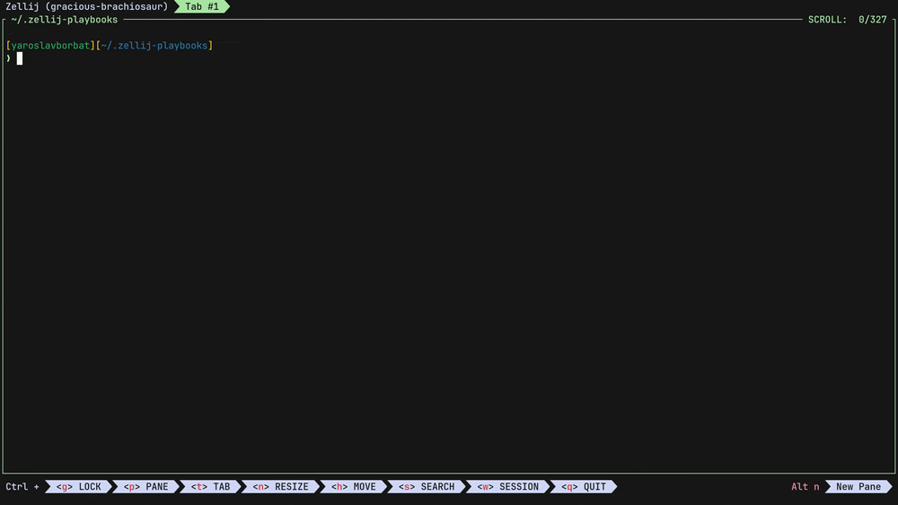

# zellij-playbooks

A [Zellij](https://zellij.dev) plugin for managing and executing playbook files. Inspired by [tome](https://github.com/laktak/tome/tree/master), this plugin allows you to browse files in the current directory, select a playbook file, and then navigate through its lines to paste them into the previous pane.



## ✨ Features

- **File Picker**: Browse and select files from the current directory
- **Line Navigation**: Step through playbook content and paste lines into the previous pane
- **Smart Filtering**: Real-time search with auto-detected mode (by ID or content)
- **Comment Filtering**: Optionally skip lines starting with `#`
- **Quick Paste**: Press `Enter` to send selected lines to the terminal
- **Mode Switching**: Switch between FilePicker, Playbook, and Usage modes
- **Pipe Mode**: Receive text from external sources via `zellij pipe`
- **Vim Integration**: Send text from Vim directly to Zellij

---

## 📖 Usage

### Basic Flow

1. Launch the plugin (e.g., with `Alt+P`)
2. In **FilePicker** mode, navigate files with `Tab`/`Up`/`Down`
3. Press `Enter` to load a file and enter **Playbook** mode
4. Navigate lines and press `Enter` to paste to the previous pane
5. Use `Left`/`Right` or `Ctrl+1/2/3` to switch modes
6. Exit with `Esc` or `Ctrl+C`

### Pipe Mode

The plugin includes a **Pipe Mode** that allows external applications to send text directly to the terminal:

1. The plugin will wait for input from external sources
2. Send text using: `zellij pipe --name zellij-playbooks -- "your text here"`
3. The text will be automatically pasted into the previous pane

### Vim Integration

A Vim plugin is included for seamless integration:

1. Install the Vim plugin (see Vim Plugin section below)
2. In Vim, use keybindings to send text to Zellij:
   - `<leader>zl` - Send current line
   - `<leader>zp` - Send word under cursor  
   - `<leader>zv` - Send selected text (visual mode)
3. Or use commands: `:ZellijPlaybooksLine`, `:ZellijPlaybooksWord`, `:ZellijPlaybooks <text>`

---

## 🚀 Installation

For compatibility details, including tested versions, see [COMPATIBILITY.md](COMPATIBILITY.md).

### From Source

1. Install Rust and Cargo if you haven't already. Follow the [installation guide here](https://www.rust-lang.org/tools/install).

   Additionally, install the `wasm32-wasip1` target by following the [documentation here](https://doc.rust-lang.org/nightly/rustc/platform-support/wasm32-wasip1.html).

2. Clone the repository, build, and install the plugin by running the following commands:
   ```bash
   git clone https://github.com/yaroslavborbat/zellij-playbooks.git
   cd zellij-playbooks
   task build
   task install
   ```

### Quick Install

For a quick installation, run the following command to download the plugin directly:
```bash
mkdir -p ~/.config/zellij/plugins && \
curl -L "https://github.com/yaroslavborbat/zellij-playbooks/releases/latest/download/zellij-playbooks.wasm" -o ~/.config/zellij/plugins/zellij-playbooks.wasm
```
> **Note**: You don't need to keep zellij-playbooks.wasm at this specified location. It's just where I like to keep my zellij plugins.

---

## ⚙️ Configuration

### Keybinding

Add the following configuration to your [Zellij config](https://zellij.dev/documentation/configuration.html) inside the [keybinds](https://zellij.dev/documentation/keybindings.html) section:

```kdl
shared_except "locked" {
    bind "Alt P" {
        LaunchOrFocusPlugin "file:~/.config/zellij/plugins/zellij-playbooks.wasm" {
            autodetect_filter_mode true
        }
    }
}
```

### Plugin Configuration

For pipe mode usage (required for Vim integration), add this to your zellij config:

```kdl
plugins {
    zellij-playbooks-pipe location="file:~/.config/zellij/plugins/zellij-playbooks.wasm" {
        pipe_mode true
    }
}

load_plugins {
    zellij-playbooks-pipe
}
```

#### Parameters

- **`autodetect_filter_mode`**: *(default: `true`)* - Automatically determines the filtering mode (ID or Name) based on the entered filter string, eliminating the need for manual mode switching.
- **`ignore_comments`**: *(default: `true`)* - Set to `true` to skip lines starting with `#`
- **`bind_reload`**: *(default: `Ctrl r`)* - Keybinding to reload files from current directory
- **`bind_switch_filter_id`**: *(default: `Ctrl i`)* - Keybinding to switch to ID filtering mode
- **`pipe_mode`**: *(default: `false`)* - Enable pipe mode for external text input
- **`cwd`**: (optional) — Set a fixed directory to always open. If specified, the plugin will ignore the current working directory and load files from this path instead.

---

## 📝 Examples

### Using with Scripts
```bash
# Create a simple playbook
echo 'echo "📝 Starting playbook execution..."' > playbook
echo "# This is a comment" >> playbook
echo "cd" >> playbook
echo "pwd" >> playbook
echo 'echo "🏁 Playbook finished. Ready for next command."' >> playbook
# Use the plugin to execute commands line by line
```

### Using with Configuration Files
The plugin works great with any text-based configuration files, scripts, or playbooks where you want to execute individual lines.

### Vim Integration Example
```vim
" In Vim, select some text and press <leader>zv
" The text will be sent to your Zellij terminal via pipe mode
```

---

## 🔌 Vim Plugin

A Vim plugin is included for seamless integration between Vim and Zellij. The plugin allows you to send text from Vim directly to your Zellij terminal.

### Installation

```bash
task vim:install
```
For more details, see the [Vim Plugin README](vim-plugin/README.md).

---
## 🧩 More Zellij Plugins by Me

- [`zellij-bookmarks`](https://github.com/yaroslavborbat/zellij-bookmarks) - A Zellij plugin for creating, managing, and quickly inserting command bookmarks into the terminal.
- [`zellij-playbooks`](https://github.com/yaroslavborbat/zellij-playbooks) - A Zellij plugin for managing and executing playbook files. 

---
## 🤝 Contributing

Found an issue or have a feature request? Feel free to [open an issue](https://github.com/yaroslavborbat/zellij-playbooks/issues/new) on GitHub.

---

## 📄 License

MIT License - see LICENSE file for details.
